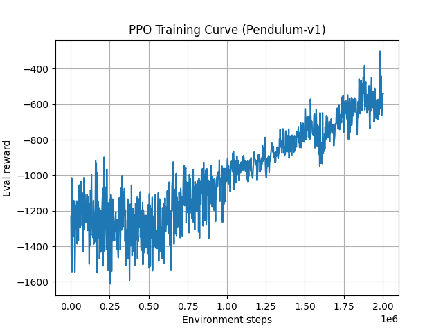

# PPO Training Summary: Acrobot-v1 vs CartPole-v1 vs Pendulum-v1

From-scratch PPO implementations for discrete and continuous control using Gymnasium environments.
The plots below are based on the printed **evaluation return** during training.

  
  

  

## Quick interpretation of the score

- **CartPole-v1**: higher is better. Typical “solved” threshold is an average return around **500**.
- **Acrobot-v1**: less negative is better.
  - Reward is approximately **-1 per step** until termination.
  - `-500` usually means the agent **timed out** at the max episode length (500 steps).
  - Around `-100` means the agent is typically solving in ~100 steps.
- **Pendulum-v1 (continuous control)**: less negative is better.
  - Action space is **continuous** (a real-valued torque).
  - In this run, returns start around **~-1500** and improve toward roughly **~-600 to -450** as the swing-up + stabilization behavior is learned.

## Observed learning behavior

### Acrobot-v1 (500k steps)

- Long flat start at **-500** (no solves) for ~100k+ environment steps.
- Clear learning transition: evaluation rapidly improves from **-500 → ~-100**.
- After ~200k steps, performance stabilizes mostly around **~-70 to -110**, with occasional regressions/spikes.

**Takeaway:** the agent learned to reliably solve Acrobot (often in <100 steps), which is a strong outcome for a minimal PPO.

### CartPole-v1 (50k steps)

- Evaluation is **high-variance**: it sometimes spikes to **~350–400**, but also drops back to much lower returns.
- The training curve suggests intermittent good policies, but not consistently stable “solved” behavior within 50k steps.

**Takeaway:** learning happens, but it looks less stable than Acrobot in this particular run (likely due to evaluation variance, short training, and minimal PPO settings).

### Pendulum-v1 (continuous task, ~2M steps)

- Early training is noisy (often **~-1500 to -1100**).
- Over time the curve shows a clear upward trend (less negative), reaching roughly **~-600 to -450** near the end of training.
- Improvements are not monotonic; evaluation returns still jump up/down between checkpoints.

**Takeaway:** for Pendulum, the correct signal is the long-run trend (less negative). This run shows steady improvement by the end, but with high variance throughout.

## Why the curves look different

- **Reward scales & termination rules differ** (`Acrobot` has a hard -500 floor; `CartPole` does not).
- **Action space differs**: `CartPole/Acrobot` are discrete-action; `Pendulum` is continuous-action.
- **Training length**: Acrobot was run for 500k steps, CartPole for 50k, and Pendulum for ~2M steps.
